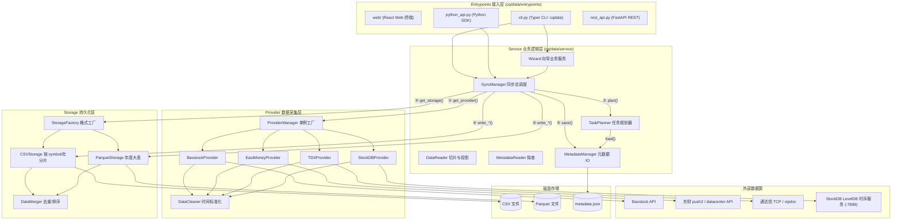

# AGENTS.md - CarrotQuant Data (`carrotquant-data`) 代码指南

本文档为 AI Agent 提供对 CarrotQuant Data (`carrotquant-data`) 项目的完整理解，包含架构、模块职责、数据流、物理存储布局与开发约束。

---

## 1. 项目概述

`CarrotQuant Data` (`carrotquant-data`) 是本地金融数据同步与持久化管理工具，支持从公开数据源（Baostock、东方财富、通达信、StockDB）获取 A 股、场内 ETF 与指数数据，经清洗后持久化为本地 CSV/Parquet 文件。

**核心能力**：
- 支持 Baostock（日线/5分线/复权因子）、东方财富（概念/行业板块/龙虎榜/机构交易）、通达信（日线/5分/1分线）、StockDB（个股/场内ETF 1分/日线全截面多因子/复权因子/同花顺概念/申万行业）
- 支持 CSV 和 Parquet 两种存储格式
- 基于时间戳水位线的增量同步与断点续接
- 四种接入方式：Python SDK (`cq.data.read()` / 链式访问器 `cq.data.ashare` / `cq.data.aetf` / `cq.data.aindex`)、Typer CLI (`cqdata`)、FastAPI REST API 与 React Web 终端 (`web/`)

**技术栈**：
- **后端**：Python >= 3.12, Polars, Baostock, curl_cffi, tdxpy, FastAPI, Typer, Loguru, PyYAML
- **前端**：Bun, React 19, Vite, TypeScript, Tailwind CSS, TradingView Lightweight Charts

---

## 2. 目录结构与模块职责

```
CarrotQuant.Data/
├── cq/
│   └── data/
│       ├── __init__.py               # 统一导出符号 (ashare, aetf, aindex, read, list_tables 等)，0 业务逻辑
│       ├── entrypoints/              # 接入层 (accessors/ OOP子包, python_api, cli, rest_api)
│       │   ├── accessors/            # OOP 便捷访问层 (base.py, ashare.py, aetf.py, aindex.py)
│       │   ├── python_api.py         # Python SDK 底层切片与探查 API
│       │   ├── cli.py                # Typer CLI 控制台主入口 (cqdata sync/server/info/tables)
│       │   └── rest_api.py           # FastAPI REST HTTP 服务 (含 Loguru SSE 日志流 & /tables/detailed)
│       ├── config/                   # 配置管理 (支持 CQDATA_DATA_DIR 环境变量与 YAML)
│       ├── provider/                 # 数据源驱动层 (Baostock, EastMoney, TDX, StockDB, DataCleaner, ProviderManager)
│       ├── service/                  # 业务逻辑层 (SyncManager, SyncProgressTracker, DataReader, TaskPlanner, MetadataManager)
│       ├── storage/                  # 持久化存储层 (CSVStorage, ParquetStorage, StorageFactory, DataMerger)
│       └── utils/                    # 工具箱 (logger_utils, time_utils)
├── web/                          # React Web 金融终端 frontend (Bun + Vite 6 + Tailwind v4 + TradingView 3-Pane)
│   ├── src/
│   │   ├── components/           # HeaderBar, SearchInput, TradingViewKLineChart, TableManagementGrid, LogTerminal, FloatingSyncWidget 等
│   │   ├── views/                # StockListView (搜索与自选), ConceptIndustryView, StockDetailView, DataMatrixView (数据矩阵), DataManagementView (数据中心)
│   │   ├── services/             # apiClient, pinyin, transformers, indicators
│   │   └── hooks/                # useMarketData, useConceptData, useTables
│   └── package.json
├── tests/                        # 测试集 (unit, integration)
└── pyproject.toml                # 项目依赖与构建配置
```

---

## 3. 系统架构与数据流

### 3.1 分层架构图



### 3.2 同步数据流

```
用户请求 (CLI / Python SDK / API / Wizard)
    │
    ▼
SyncManager.sync()
    ├── 1. ProviderManager.get_provider(table_id) -> 获得 Provider 实例
    ├── 2. TaskPlanner.plan() -> 比较本地 metadata 水位线与目标时间，规划补充任务
    ├── 3. 批处理循环 (batch_size 切分 symbols):
    │      ├── Provider.fetch() -> 拉取原始数据 -> DataCleaner.standardize() 标准化
    │      └── Batch pl.concat() -> 批量写入 CSVStorage / ParquetStorage
    └── 4. 物理巡检与元数据更新:
           Storage 检查物理状态 -> MetadataManager.save() 原子化更新 metadata.json
```

---

## 4. 核心模块与类职责

### 4.1 接入层与配置 (Gateway & Config)
- **`config/settings.py`**: 全局 `Settings` 配置管理，支持自动加载本地 `.env` 环境变量、通过 `cq.data.configure()` 加载 YAML 配置，或使用环境变量 `CQDATA_DATA_DIR` 和 `CQDATA_CONFIG_PATH`。完整 YAML 配置示例见 [config.yaml.sample](file:///d:/Quant/CarrotQuant.Data/config/config.yaml.sample)，`.env` 模板见 [.env.sample](file:///d:/Quant/carrotquant-data/.env.sample)。
- **`accessors/` 包**: 提供 OOP 便捷访问层子包（`ashare.kline`, `aetf.kline`, `aindex.kline` 等）。遵循权责到表原则：数据源（`source`, `supported_sources`）与存储格式（`format`, `supported_formats`）严格收敛于具体表级独立管理并具备强类型防呆拦截；市场级（`ashare`, `aetf`, `aindex`）作为零状态纯净命名空间。默认 `raw` 极速零开销直读原始行情；显式 `adj="adj"` 时优先直读静态复权表，若无则平滑降级为 `raw + adj_factor` 动态后复权折算（因子缺失时严格抛错中断）；概念与行业板块（`ashare.concept`, `ashare.industry`）原生支持 `board_code` 精确定向过滤成分股。
- **`python_api.py`**: 提供 SDK 高阶 API (`read`, `write`, `register_provider` 双模注册器/类装饰器, `list_sources`, `list_tables`, `sync`, `configure`, `get_schema`, `get_time_range` 等)，以磁盘物理 `metadata.json` 与动态 Provider 路由为基础，原生支持内置表与自定义外部表。
- **`cli.py`**: 基于 Typer 的 CLI 工具 (`cqdata sync`, `cqdata import`, `cqdata sources`, `cqdata tables`, `cqdata info`, `cqdata server`, `cqdata wizard`)，支持通过 `cqdata server --open` 自动唤醒系统浏览器访问内置 Web 终端，支持 `cqdata import` 导入外部 CSV/Parquet 文件。
- **`rest_api.py`**: 基于 FastAPI 的 RESTful HTTP 服务，挂载 CORS 跨域中间件，提供 `POST /api/v1/write` 写入、`GET /api/v1/sources` 数据源清单探查、`GET /api/v1/tables` 表元数据探查、`GET /api/v1/data/{market}/{category}` 通用动态业务语义切片查询（全自动智能路由 OOP 访问器与外部导入表，服务端开箱即用动态后复权折算）与 `GET /api/v1/query` 底层物理切片查询，所有 Polars IO/磁盘读取端点均采用普通 `def` 函数声明派发至底层的 Worker 线程池并发处理，杜绝主事件循环卡顿，并内置托管 `cq/data/static/` 前端 SPA 静态资源。


### 4.2 业务服务层 (Service)
- **`SyncManager`**: 数据同步总调度器，贯穿 Provider 拉取、批处理、Storage 写入与元数据盖章。
- **`DataWriter`**: 统一外部数据写入服务，负责外部 DataFrame 标准化（默认 `timeseries` 时序契约、显式 `event` 事件表、补齐 `timestamp` 与 ISO `datetime`）、多格式持久化落盘与原子化元数据生成。

- **`DataReader` / `MetadataReader`**: 提供多年份切片读取、按列投影选择与元数据探查。
- **`DataAdjuster`**: 动态后复权计算引擎，基于 Polars 向量化实现 `[symbol, date]` 跨频与跨年份 Asof Join，具备历史截断前向填充、停牌保护与次新股 1.0 保底等边界防御。
- **`TaskPlanner`**: 根据各格式的水位线（取保守交集）规划前向补全与后向拓展的任务区间（首次无水位且未指定 start_date 时默认 fallback 至 2020-01-01）。
- **`MetadataManager`**: 负责 `metadata.json` 的原子化读写（`.tmp` -> `os.replace` -> `fsync`）。


### 4.3 数据驱动层 (Provider)
- **`BaseProvider` (ABC)**: 驱动抽象基类，规范 `fetch`, `get_all_symbols`, `get_supported_tables`, `get_table_category`, `get_sort_keys` 接口。
- **`BaostockProvider`**: Baostock 数据驱动，处理个股/指数 K 线与复权因子，支持 RLock 线程锁并发防护、API 错误码 (如网络接收错误/未登录) 识别与自动重新登录 (`_relogin`) 重试。
- **`EastMoneyProvider`**: 东方财富数据驱动，处理板块成分股、龙虎榜与机构交易，采用 TLS 指纹防封与节流重试。无 symbol 的宏观表 `get_all_symbols` 返回 `["_ALL_"]`。
- **`TDXProvider`**: 通达信数据驱动，支持 `online` (TCP 在线) 与 `local` (vipdoc 离线) 两种模式，完整覆盖沪深主板、创业板、科创板与北交所（注：`online` 模式受云端 API 限制仅覆盖在交易股票，获取已退市股票建议使用 `local` 离线模式或 Baostock 驱动）。
- **`StockDBProvider`**: StockDB 本地 LevelDB 时序引擎驱动（127.0.0.1:7899），支持 1m 超高频与 1d 全截面多因子、A 股个股与退市股全覆盖、场内 ETF 独立覆盖、同花顺概念与申万行业平铺映射。内置 `stockdb.pyd` 与 TCP Socket 快速探针。
- **`DataCleaner`**: 统一清洗时间轴，转换产生 `timestamp` (Int64 ms) 与 `datetime` (ISO8601) 标准列。
- **`ProviderManager`**: Provider 单例工厂，根据 `table_id` 末段标识路由驱动。

### 4.4 持久化存储层 (Storage)
- **`StorageManager` (ABC)**: 存储抽象基类，统一 `read_series`, `read_event`, `write_series`, `write_event` 接口。
- **`CSVStorage`**: TS 数据按 `[symbol, year]` 分片 CSV；EV 数据按 `[year]` 或平铺存储。
- **`ParquetStorage`**: TS/EV 数据按 `[year]` 保存为 zstd 压缩 Parquet 大表或平铺大表。
- **`DataMerger`**: 负责新旧 Polars DataFrame 的增量合并（`unique keep='last'`）与多维列排序。

---

## 5. Table ID 命名规范

格式: `{market}.{category}.[sub_category/freq/adj].{source}`

| 字段 | 说明 | 示例 |
|:---|:---|:---|
| market | 市场标识 | `ashare` (A股个股), `aetf` (A股场内基金与ETF), `aindex` (A股指数) |
| category | 数据类别 | `kline` (K线), `adj_factor` (复权因子), `dragon_tiger` (龙虎榜), `concept` (概念板块), `industry` (行业板块) |
| freq/adj | 频率/复权 (可选) | `1d` (日线), `5m` (5分钟), `1m` (1分钟), `adj` (后复权), `raw` (不复权) |
| source | 数据源 (末段，路由依据) | `baostock`, `eastmoney`, `tdx`, `stockdb` |

**主要注册表**:
- `ashare.kline.1d.adj.baostock` / `ashare.kline.1d.raw.baostock` (TS)
- `ashare.kline.5m.adj.baostock` / `ashare.kline.5m.raw.baostock` (TS)
- `aindex.kline.1d.raw.baostock` (TS)
- `ashare.adj_factor.baostock` (EV)
- `ashare.concept.eastmoney` / `ashare.industry.eastmoney` / `ashare.dragon_tiger.eastmoney` / `ashare.inst_trade.eastmoney` (EV)
- `ashare.kline.1d.raw.tdx` / `ashare.kline.5m.raw.tdx` / `ashare.kline.1m.raw.tdx` (TS)
- `aindex.kline.1d.raw.tdx` / `aindex.kline.5m.raw.tdx` / `aindex.kline.1m.raw.tdx` (TS)
- `ashare.kline.1m.raw.stockdb` / `ashare.kline.1d.raw.stockdb` (TS)
- `ashare.adj_factor.stockdb` (EV)
- `ashare.concept.stockdb` / `ashare.industry.stockdb` (EV)
- `aetf.kline.1m.raw.stockdb` / `aetf.kline.1d.raw.stockdb` (TS)
- `aetf.adj_factor.stockdb` (EV)

---

## 6. 存储布局与元数据协议

### 6.1 Hive 分区存储结构

```
data/
├── csv/
│   └── {table_id}/
│       ├── year={yyyy}/{symbol}.csv   # TS (TimeSeries) 模式
│       ├── year={yyyy}/data.csv       # EV (Event 有 timestamp) 模式
│       ├── data.csv                   # EV (Event 无 timestamp) 平铺模式
│       └── metadata.json
└── parquet/
    └── {table_id}/
        ├── year={yyyy}/data.parquet   # TS & EV (有 timestamp) 模式
        ├── data.parquet               # EV (无 timestamp) 平铺模式
        └── metadata.json
```

### 6.2 路径模板表

| 数据类型 | CSV 路径 | Parquet 路径 |
|:---|:---|:---|
| TimeSeries (TS) | `csv/{table_id}/year={yyyy}/{symbol}.csv` | `parquet/{table_id}/year={yyyy}/data.parquet` |
| Event (EV) 有 timestamp | `csv/{table_id}/year={yyyy}/data.csv` | `parquet/{table_id}/year={yyyy}/data.parquet` |
| Event (EV) 无 timestamp | `csv/{table_id}/data.csv` | `parquet/{table_id}/data.parquet` |
| 元数据 | `{format}/{table_id}/metadata.json` | `{format}/{table_id}/metadata.json` |

### 6.3 元数据规范 (metadata.json)

每个表及格式维护独立的 `metadata.json`，包含了顶层显式版本号 `"version": 1`、`schema` 与 `statistics`（包括上次同步的系统挂钟时间 `updated_at`、起止时间戳、ISO时间与 `total_bars`）。
> **更新时间说明**：`statistics.updated_at` 为每次数据刷盘成功时的系统 ISO8601 时间戳（如 `"2026-08-10T16:25:00.000+08:00"`），方便前端与 API 精准识别物理数据的最新刷新时刻。
> **EV 表性能优化**：EV 表的 `metadata.json` 严禁包含 `symbol_count` 和 `time_steps` 字段，巡检时跳过大文件全量扫描。对于无 timestamp 的平铺模式（如板块成分股），`statistics` 包含 `updated_at` 和 `total_bars`。
> **复权因子说明**：仅保留后复权因子 `back_adj_factor`，剔除可变的历史前复权因子，防止历史数据变更污染增量水位线。

### 6.4 TS 与 EV 存储行为差异

| 维度 | TS (TimeSeries) | EV (Event) 有 timestamp | EV (Event) 无 timestamp |
|:---|:---|:---|:---|
| 分区模式 | CSV: `[symbol, year]` / PQ: `[year]` | 按 `[year]` | 平铺文件 |
| 去重策略 | `subset=["symbol", "timestamp"]` | 全行去重 `subset=None` | 全行去重 `subset=None` |
| 默认排序 | CSV: `["timestamp"]` / PQ: `["symbol", "timestamp"]` | `["timestamp", "symbol"]` | 由 Provider `get_sort_keys()` 指定 |

---

## 7. 数据协议与双时间轴

### 7.1 核心字段契约
入库数据必须包含以下时间与主键字段：
- `timestamp`: Int64 (UTC 毫秒级时间戳) — 去重、分区、排序的主键
- `datetime`: String (ISO8601 带偏移，如 `"2024-01-01T15:00:00.000+08:00"`) — 强时区带偏移的可读列
- `symbol`: String (证券代码，如 `"sh.600000"`) — 复合主键之一

### 7.2 双时区机制
- **`source_tz`**: 用于解析原始挂钟时间对齐到 UTC 0（默认 `"Asia/Shanghai"`）。
- **`display_tz`**: 用于生成带偏移量的 ISO8601 `datetime` 显示列（默认 `"Asia/Shanghai"`）。
- **A股日线对齐规则**: 日线数据默认统一对齐至 `15:00:00`（A股收盘时间），防止跨日边界物理分区错位。
- **时间戳下限归一化 (Epoch 0)**:
  - `ts_to_str(0)` 格式化返回 `"1970-01-01"`，防止受系统 C 库负时间戳影响抛出 `OSError` 或返回空字符串。
  - 对于早于 1970 年的日期字符串（如 `"1900-01-01"`）或空字符串，`parse_date_to_ts` 自动将其截断修剪为 Unix 起始零点 `ts = 0`（`1970-01-01`），以满足“全量拉取有记录完整历史数据”的标准语义。
- 必须使用标准 `zoneinfo` 库处理时区，严禁手动计算偏移。

### 7.3 类型映射规约 (type_map)
读取数据时，必须依据 `metadata.json` 定义的 schema 显式执行 `pl.cast()`：
```python
type_map = {
    "Int64": pl.Int64, "Float64": pl.Float64, "String": pl.String,
    "Boolean": pl.Boolean, "Date": pl.Date, "Datetime": pl.Datetime
}
```

---

## 8. 核心设计原则

### 8.1 架构哲学与设计指导
1. **第一性原理 (First Principles)**:
   从问题本质出发设计，绝不增加无必要的中间层或冗余形参。代码逻辑追求极简、直观与高执行效率，拒绝任何花里胡哨的过度设计与魔术推测。
2. **单一事实来源 (Single Source of Truth, SSOT)**:
   - 物理磁盘的 `metadata.json` 是数据属性、Schema 与起止范围的唯一事实标准。
   - 探查与读取数据时严格以磁盘 `metadata.json` 为准，绝不在代码中凭空假设或做模棱两可的降级猜测。
3. **高内聚低耦合的分层架构 (Layered Architecture)**:
   - **Entrypoints (接入层)**: 仅负责参数校验与路由，0 业务逻辑。
   - **Service (服务层)**: 负责同步规划、数据切片调度与元数据原子刷盘。
   - **Provider (驱动层)**: 专一负责网络/二进制数据拉取与 `DataCleaner` 标准化。
   - **Storage (存储层)**: 专一负责增量合并 (`DataMerger`)、去重、排序与 Hive 物理落盘。
   - **单向依赖规则**: 接入层 ➔ 服务层 ➔ 驱动层/存储层，严格禁止跨层反向调用。
4. **前端文案与 UI 专业性规范 (Professional UI & Tone)**:
   - **拒绝 AI 营销修饰感**：严禁在 UI 标题、描述与注释中使用形如“极速引擎”、“强同步研判”、“底层透视”、“全量数据共享”、“0ms 内存极速切片”等夸张、AI 化、营销感重的冗长词汇。
   - **回归金融终端本质**：UI 文案必须精炼、概要、间接、专业，保持类似 Bloomberg / TradingView 官方终端的干练风格（如：“K 线行情”、“数据矩阵”、“按时间序列展现 OHLC 与成交量明细”）。

### 8.2 物理与鲁棒性原则
1. **原子落盘**: 任何写操作均采用 `.tmp` 文件写入 -> `os.replace` -> `fsync` 刷盘，杜绝写入中断导致文件损坏。
2. **读取强锁与显式 Cast**: 读取数据时必须读取 `metadata.json` 的 schema 进行显式 `pl.cast()`，严禁使用 Polars 自动类型推断。
3. **空数据防御三层机制**:
   - *驱动层*: 无数据时也必须通过 `DataCleaner` 返回带完整 schema 的空 DataFrame。
   - *存储层*: 传入空 DataFrame 时静默拦截，不创建空文件或残留目录。
   - *元数据层*: `total_bars=0` 且无元数据时不创建文件；无新数据且已有元数据时不重复更新。
4. **Fail-Fast 异常分发与元数据延迟盖章**:
   - 网络中断、网络授权失效或非法参数：必须抛出异常中断流水线，防止水位线被误推进。
   - 元数据盖章 `_update_metadata()` 严格在全量批次成功落盘下沉后统一调用，确保中途中断时水位线不虚高，保障下一次重新同步能无损补全全量历史数据。
   - 业务合法空数据（如停牌、无龙虎榜记录）：允许返回带 Schema 的空表。
5. **增量水位线**: 多格式同步时水位线取交集保守计算 (`start` 取 max, `end` 取 min)，保证各存储格式完整覆盖。
6. **无损降级处理**: EV 数据在缺少 `symbol` 列时自动回退为仅按 `timestamp` 排序，严禁抛出 `ColumnNotFoundError`。
7. **驱动层强类型构造规约**: 从原始数据构造 DataFrame 必须显式传入 `schema` 强类型字典（如 `pl.DataFrame(records, schema=raw_schema)`），严禁使用自动类型推断，防止因前缀连续 `None` 误判为 `Null` 导致后续数据追加溢出崩溃，并确保批处理批量聚合时 Schema 严格对齐。

---

## 9. 开发与测试约束

- **零盲目假设与沟通契约**:
  - **严禁盲目假设**：当对需求意图、架构变动或接口设计存在不确切或多种可选方案时，必须先提出疑问与方案选择，与用户讨论确认后再执行代码修改，严禁擅自做主更改逻辑。
  - **严禁擅自编写兜底/降级逻辑**：当遇到不确定的边界条件、第三方 API 异常或逻辑未尽事项时，**严禁自动编写隐式兜底/降级代码**（如静默 try-except 容错、假默认值 fallback、模棱两可的硬编码兜底），必须第一时间向用户提出疑问与方案选择，经用户明确确认后再执行代码实现。
  - **最小改动原则**：代码修改严格遵循最小可行改动原则，严禁删除不相关的代码与注释。
- **技术栈禁令**: 强制全系统使用 Polars (`pl`)，**严禁使用 pandas**（包括 SDK 接口、类型提示与数据转换，全量基于 Polars）。
- **包管理与安装禁令**: **严禁使用 `pip install`** 方式安装依赖包。项目包管理一律统一使用 `uv` 工具链（如 `uv sync` / `uv add`）。
- **复权约束**: 仅支持 `raw` (不复权) 或 `adj` (后复权)，禁止前复权。
- **Import 规范**: 代码文件中所有的 `import` 语句（包含标准库、第三方库与本地模块）**默认统一集中放在文件最开始顶部位置**，严禁在函数、类或文件中间随意分散放置 `import`。
- **干净入口**: `cq/data/__init__.py` 仅用于符号导出，实现 **0 业务逻辑**。
- **时区规范**: 统一使用 `zoneinfo`，禁止手动加减小时偏移。
- **日志与输出**:
  - 系统日志使用 Loguru，输出挂载至 `stderr` 及 `logs/{prefix}_{YYYYMMDD_HHMMSS}.log`。
  - 核心驱动层调第三方库（如 Baostock）必须使用 `SuppressOutput` 包裹，防止垃圾 `print` 污染 CLI 控台。
- **测试覆盖与质量约束**:
  - **全层级测试同步**：更新代码、重构逻辑或增加新功能时，必须同步补充与修改对应的**单元测试 (Unit Test)**、**集成测试 (Integration Test)** 以及 **端到端测试 (E2E Test)** 代码。
  - **边界与异常防御**：必须深入分析并合理考虑**边界条件**（如空 DataFrame、极值起止时间戳、重复主键去重、缺失字段、物理盘未落盘状态）与**异常情况**（如网络中断重连、格式解析失败、第三方 API 崩溃、未定义市场代码），增加针对性的防错校验与断言测试。
  - **后端与前端自动化运行**：后端测试统一使用 `uv run pytest tests/ -v` 命令；前端与 E2E 测试使用 Bun 工具链（`bun run test:unit` / `bun run test:e2e`）。
- **Git 提交**:
  - 消息语言为中文，遵从 Conventional Commits 规范（如 `feat:` / `fix:` / `refactor:`）。
  - **默认生成完整多行 Commit 消息**：包含首行简短 Summary（如 `feat(web): ...`）以及详细的多点 List 说明（`- ...`），供用户审核确认。
  - 未经用户明确确认，禁止自动执行 `git add/commit/push` 操作。
- **版本发布与 bump 规范**:
  - 项目在 `pyproject.toml` 中配置了 `[tool.bumpversion]` 自动化关联，将 `pyproject.toml` 和 `cq/data/__init__.py` 的版本号保持强同步。
  - 严禁手动多处修改版本号。更新版本统一通过 `bump-my-version` 工具链自动升级并打 Tag：
    - 升级修补版本号 (`1.1.0` ➔ `1.1.1`): `uv run bump-my-version bump patch`
    - 升级次版本号 (`1.1.0` ➔ `1.2.0`): `uv run bump-my-version bump minor`
    - 升级主版本号 (`1.1.0` ➔ `2.0.0`): `uv run bump-my-version bump major`
- **文档与示例同步契约**: 任何涉及架构、核心 API、接入面 (Entrypoint) 或数据结构的改动，必须**同时同步更新**以下 4 处内容：
  1. `AGENTS.md`
  2. `README.md`
  3. `docs/` 目录下的相关指南文档 (如 `docs/rest_api_guide.md` 与 `docs/python_sdk_guide.md` 等)。
  4. `examples/` 目录下的示例代码脚本。

---

## 10. 测试结构与运行

### 10.1 测试目录结构
```
CarrotQuant.Data/
├── tests/                         # 后端 Python 测试集
│   ├── conftest.py                # 全局 fixtures (temp_storage_root, mock_baostock)
│   ├── unit/                      # 工具、Provider、Storage、Service 及 Entrypoints 单元测试 (mock IO)
│   └── integration/               # 真实 API 与全流程同步测试 (包含全量/增量/防封/空数据测试)
└── web/                           # 前端 React / Web 终端测试集
    ├── src/__tests__/             # 前端 Component、Hook、Service 单元测试 (Vitest)
    └── e2e/                       # 端到端 API 与 UI 自动化测试 (Playwright)
```

### 10.2 常用测试命令
```bash
# 后端 pytest 测试
uv run pytest tests/ -v                                   # 运行全部后端测试 (单元 + 集成)
uv run pytest tests/unit/ -v                              # 仅运行单元测试
uv run pytest tests/integration/ -v                       # 仅运行集成测试

# 前端与 E2E 测试
cd web && bun run test:unit                                # 运行前端单元测试 (Vitest)
cd web && bun run test:e2e                                 # 运行前端与 UI 端到端测试 (Playwright)
```

---

## 11. 新增数据源指南

新增数据源驱动时遵循以下步骤：
1. 在 `cq/data/provider/` 下新建 `{source}_provider.py`，继承 `BaseProvider`。
2. 实现 `fetch`, `get_all_symbols`, `get_supported_tables`, `get_table_category`, `get_sort_keys` 方法。
3. 在类属性 `_SUPPORTED_TABLE_MAP` 中注册可用的 `table_id`。
4. 在 `ProviderManager.get_provider()` 中加入该驱动的路由逻辑。
5. 驱动调第三方 API 时使用 `SuppressOutput` 包裹控制台输出。
6. `fetch()` 返回数据需经过 `DataCleaner.standardize()`，无数据时返回带完整 Schema 的空表。
7. 在 `tests/unit/` 和 `tests/integration/` 中补充对应的单元与集成测试。
