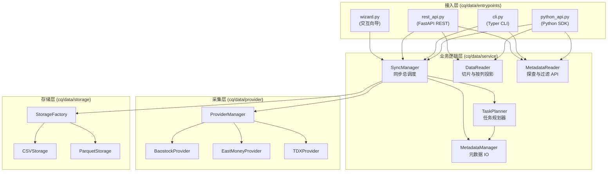

# CarrotQuant Data (`carrotquant-data`)

[](https://pypi.org/project/carrotquant-data/)
[](https://pypi.org/project/carrotquant-data/)
[](LICENSE)

**CarrotQuant Data** (`carrotquant-data`) 是专为量化交易与回测设计的本地金融数据同步与管理工具，支持多源拉取、增量同步与高效列式存储。

## 🛠️ 特性 (Features)

- **多数据源支持**：内置 [Baostock](http://baostock.com/)、东方财富、[通达信 (tdxpy)](https://github.com/rainx/tdxPy) 等金融数据源驱动，支持灵活扩展。
- **灵活的存储格式**：原生支持 `csv` 与列式存储 `parquet` 格式。
- **增量与全量同步**：基于时间戳水位线机制，支持断点续接（增量拉取）与全量覆盖更新。
- **多接入方式**：
  - **React Web 终端**：基于 Bun + Vite + React 19 构建，集成 TradingView Lightweight Charts (3-Pane 图表)、多维搜索与数据管理面板。
  - **Python SDK**：直观的 `import cq.data` API，支持高性能跨年份数据切片读取 (`cq.data.read`)、`columns` 按需投影与元数据探查。
  - **命令行工具 (CLI)**：统一的 `cqdata` 命令行工具，提供数据同步 (`cqdata sync`)、数据表探索 (`cqdata tables`) 与服务启动 (`cqdata server`)。
  - **REST API 服务**：基于 FastAPI 的 HTTP 服务，支持数据切片、任务调度与 SSE 实时日志流。
- **列式数据处理**：使用 [Polars](https://pola.rs/) 进行高效的数据清洗与结构转换。

## 📁 目录结构 (Project Structure)

```text
CarrotQuant.Data/
├── cq/
│   └── data/         # 核心代码包 (import cq.data)
│       ├── entrypoints/  # 接入层 (python_api, cli, rest_api)
│       ├── config/       # 配置管理模块
│       ├── provider/     # 数据源驱动 (BaostockProvider, EastMoneyProvider, TDXProvider)
│       ├── service/      # 核心业务逻辑 (DataReader, MetadataReader, SyncManager 等)
│       ├── storage/      # 本地持久化存储 (CSVStorage, ParquetStorage)
│       └── utils/        # 通用工具箱
├── web/              # React Web 金融终端 (Bun + Vite 6 + React 19 + TradingView 3-Pane)
│   ├── src/          # 视图 View、组件 Component、Hooks 与转换服务
│   └── package.json
├── scripts/
│   ├── wizard.py         # 交互向导脚本 (也可通过 cqdata wizard 运行)
│   └── download_tdx.py   # 通达信数据下载脚本
├── tests/            # 单元测试与集成测试
├── config/           # 项目配置文件存放目录
├── logs/             # 系统运行日志目录
├── AGENTS.md         # AI Agent 架构指南
└── pyproject.toml    # 项目构建及依赖配置
```

## 🏗️ 系统架构



## 📊 支持的数据表 (Supported Tables)

| Table ID | 类型 | 说明 |
|----------|------|------|
| `ashare.kline.1d.adj.baostock` | TS | A 股日线后复权 |
| `ashare.kline.1d.raw.baostock` | TS | A 股日线不复权 |
| `ashare.kline.5m.adj.baostock` | TS | A 股 5 分钟线后复权 |
| `ashare.kline.5m.raw.baostock` | TS | A 股 5 分钟线不复权 |
| `aindex.kline.1d.raw.baostock` | TS | A 股指数日线 |
| `ashare.adj_factor.baostock` | EV | A 股复权因子 |
| `ashare.concept.eastmoney` | EV | 概念板块成分股 |
| `ashare.industry.eastmoney` | EV | 行业板块成分股 |
| `ashare.dragon_tiger.eastmoney` | EV | 龙虎榜 |
| `ashare.inst_trade.eastmoney` | EV | 机构买卖每日统计 |
| `ashare.kline.1d.raw.tdx` | TS | A 股日线 (通达信) |
| `ashare.kline.5m.raw.tdx` | TS | A 股 5 分钟线 (通达信) |
| `ashare.kline.1m.raw.tdx` | TS | A 股 1 分钟线 (通达信) |
| `aindex.kline.1d.raw.tdx` | TS | 指数日线 (通达信) |
| `aindex.kline.5m.raw.tdx` | TS | 指数 5 分钟线 (通达信) |
| `aindex.kline.1m.raw.tdx` | TS | 指数 1 分钟线 (通达信) |

## 🛠️ 安装指南 (Installation)

环境要求：**Python >= 3.12**（支持 Python 3.12 / 3.13 / 3.14+）。

### 1. 通过 PyPI 安装 (推荐)
```bash
# 推荐使用 pip 直接安装
pip install carrotquant-data

# 或使用 uv 安装
uv add carrotquant-data
```

### 2. 源码克隆与本地开发安装
```bash
git clone https://github.com/CRThu/carrotquant-data.git
cd carrotquant-data

# 可编辑模式挂载命令行 cqdata
uv pip install -e .
```

## ⚙️ 配置说明 (Configuration)

CarrotQuant.Data 秉承 **“显式胜于隐式 (Explicit is better than implicit)”** 的配置契约，支持以下显式加载与覆盖方式（优先级从高到低）：

1. **代码程序化修改**：直接设置单例属性 `cq.data.settings.data_dir = "/path/to/data"` 或调用 `cq.data.configure("/path/to/config.yaml")`（最高优先级）。
2. **环境变量 `CQDATA_DATA_DIR`**：如 `export CQDATA_DATA_DIR="/my/data/path"`（适合 Docker / CLI / 自动化部署）。
3. **环境变量 `CQDATA_CONFIG_PATH`**：指定自定义 YAML 配置文件路径，如 `export CQDATA_CONFIG_PATH="/path/to/config.yaml"`。
4. **内置默认配置**：默认存储路径 `data_dir = "data"`，默认日志 `log_dir = "logs"`, `log_level = "INFO"`。

完整配置文件结构参考 [config.yaml.sample](file:///d:/Quant/CarrotQuant.Data/config/config.yaml.sample)：

```yaml
# config.yaml
data_dir: "data"       # 数据存储根目录
log_dir: "logs"        # 日志输出目录
log_level: "INFO"      # 日志级别 (DEBUG/INFO/WARNING/ERROR)

# OOP 访问层全局默认配置链
defaults:
  source: "baostock"
  format: "parquet"
```

---

## 🚀 快速开始 (Quick Start)

### 方式一：使用 Python SDK (`import cq.data`) - 推荐

在量化研究与 Python 策略脚本中直接读取本地清洗好的数据：

```python
import cq.data

# 0. (可选) 从 YAML 配置文件加载全局配置
cq.data.configure("./config.yaml")

# 或者直接修改属性
cq.data.settings.data_dir = "./custom_data"

# 1. OOP 便捷读取 (界面极简，干净清爽)
df_kline = cq.data.ashare.kline.get(symbols="sh.600000", start_date="2024-01-01")

# 2. 查阅代码清单、时间跨度、Schema 映射与物理总行数
symbols = cq.data.list_symbols("ashare.kline.1d.raw.baostock")
start_dt, end_dt = cq.data.get_time_range("ashare.kline.1d.raw.baostock")
schema = cq.data.get_schema("ashare.kline.1d.raw.baostock")         # {'timestamp': 'Int64', ...}
total_rows = cq.data.get_row_count("ashare.kline.1d.raw.baostock") # 13570685

# 3. 统一切片读取 K 线时序数据 (支持 columns 按需挑选列，极节省内存)
df = cq.data.read(
    table_id="ashare.kline.1d.raw.baostock",
    symbols=["sh.600000", "sz.000001"],
    start_date="2024-01-01",
    end_date="2024-06-30",
    columns=["timestamp", "datetime", "symbol", "close", "volume"]
)
print(df)

# 4. 统一切片读取板块/龙虎榜事件数据
events_df = cq.data.read(
    table_id="ashare.concept.eastmoney",
    symbols=["sh.600000"]
)

# 5. 代码中触发全自动数据同步
cq.data.sync(table_ids=["ashare.kline.1d.raw.baostock"], formats=["parquet"])
```

### 方式二：使用统一 CLI 命令行工具 (`cqdata`)

可在终端或 Cron 定时任务中直接调用 `cqdata` 交互：

```bash
# 查看本地存储的所有数据表概览
cqdata tables

# 查看某张表的物理行数、代码列表与 Schema 详细元数据
cqdata info ashare.kline.1d.raw.baostock

# 触发自动增量同步
cqdata sync --tables "ashare.kline.1d.raw.baostock,ashare.adj_factor.baostock"

# 指定日期区间与保存格式进行全量强制更新
cqdata sync -t ashare.kline.1d.raw.baostock -f parquet -s 2023-01-01 -e 2023-12-31 --force
```

#### 💡 通达信 (TDX) 最佳同步实践说明

通达信驱动支持 **Local (离线 vipdoc 导包)** 与 **Online (在线 TCP 协议)** 两种模式。两者的输出格式和字段完全对齐，落地在同一个 `table_id` 下，数据会自动无缝去重与合并。

- **Local 离线模式读取能力**：原生支持解析本地 `vipdoc` 目录下的 **日线 (`.day`)、5分钟线 (`.lc5`) 以及 1分钟线 (`.lc1`)** 等所有离线二进制文件（包含通达信软件自行下载导出的分钟线文件）。
- **极速初始化脚本 (`cqdata tdx download`)**：用于一键拉取并解压通达信官方服务器的全量日线行情包（`hsjday.zip`），实现数十年日线历史数据的秒级导入。

> [!TIP]
> **强烈推荐的最佳实践流程**：
> 1. **首次极速初始化（Local 模式）**：通过 `cqdata tdx download` 下载官方 `vipdoc` 日线离线包（或直接挂载本地已有的通达信客户端 `vipdoc` 目录）解析导入，秒级完成历史数据装载。
> 2. **日常增量更新（Online 模式）**：日常收盘后直接执行在线增量同步，系统会自动根据水位线补全最新几日的增量 K 线（支持 1d / 5m / 1m）。

```bash
# 步骤 1: 极速初始化 - 下载并解压通达信官方全量日线行情包 (hsjday.zip)
cqdata tdx download
# 或使用 uv 直接运行下载脚本 (也可通过 --tdx-vipdoc 指定本地已有通达信客户端目录)
uv run scripts/download_tdx.py

# 步骤 2: 日常盘后增量 - 触发通达信在线按水位线追加最新数据 (支持 1d 日线 / 5m / 1m 分钟线)
cqdata sync -t ashare.kline.1d.raw.tdx
```

**命令行关键参数：**
- `-t` / `--tables`: 必填，要同步的表 ID，多表用逗号分隔。
- `-f` / `--formats`: 选填，保存格式（默认 `parquet,csv`）。
- `-s` / `--start` & `-e` / `--end`: 选填，时间范围，留空则是自动接续水位线增量同步。
- `--force`: 选填，强制全量刷新覆盖。
- `--limit`: 选填，限制同步代码数量（调试用）。

### 方式三：使用终端交互向导 (Wizard)

```bash
cqdata wizard
```

### 方式四：一键启动服务器与 Web 终端 (支持 --open / -o 自动打开浏览器)
```bash
# 启动后端 API 服务并自动调起系统浏览器打开 Web 终端
cqdata server --port 8888 --open

# (也可使用 -c 指定配置文件: cqdata server -p 8888 -c ./config.yaml -o)
```

启动后内置托管 React Web 终端并提供基于 FastAPI 的 RESTful HTTP 接口（全量端点汇总）：

| 端点 | 方法 | 说明 |
|------|------|------|
| `/` | GET | 内置托管的 React Web 金融终端主界面 |
| `/api/v1/health` | GET | 系统健康检查与服务运行状态探针 |
| `/api/v1/tables` | GET | 列出本地所有数据表总览 (平铺列表，含 `category` 属性) |
| `/api/v1/tables/detailed` | GET | 获取所有数据表及其各存储格式 (Parquet / CSV) 独立物理元数据 |
| `/api/v1/tables/{table_id}/formats` | GET | 获取指定表已存储的物理格式列表 (`['parquet', 'csv']`) |
| `/api/v1/tables/{table_id}/symbols` | GET | 获取指定表已下载的股票/证券代码列表 |
| `/api/v1/tables/{table_id}/time_range` | GET | 获取指定表的时间跨度 tuple `(start_datetime, end_datetime)` |
| `/api/v1/tables/{table_id}/schema` | GET | 获取指定表的字段列名与类型字典 |
| `/api/v1/tables/{table_id}/row_count` | GET | 获取指定表的记录总条数/行数 |
| `/api/v1/tables/{table_id}/boards` | GET | 聚合板块概念/行业列表及各板块成分股计数，支持关键词搜索 |
| `/api/v1/query` | GET | 统一切片查询接口（支持 `symbols`, `board_code`, `start_date`, `end_date`, `columns`, `page`, `page_size`），按 `table_id` 自动智能路由 |
| `/api/v1/sync` | POST | 异步触发后台数据同步任务 |
| `/api/v1/tasks` | GET | 查询当前正在运行的同步任务列表 |
| `/api/v1/sync/status` | GET | 获取所有同步任务的详细进度状态（含百分比、当前代码与错误信息） |
| `/api/v1/logs/stream` | GET | SSE (Server-Sent Events) 实时系统与数据同步日志流 |
| `/api/v1/tdx/check` | GET | 检查通达信本地 `vipdoc` 目录有效性与代码统计 |
| `/api/v1/tdx/download` | POST | 后台从通达信官方服务器下载全量 `hsjday.zip` 日线包并自动解压 |
| `/api/v1/filesystem/list` | GET | 本地文件与目录探查接口 (供 Web 文件选择器使用) |

### 方式五：前端 UI 开发与热重载调试 (`web/`)

进行前端界面开发或组件调试时，可启动 Vite 热重载服务：

```bash
# 1. 启动后端 REST API 服务
cqdata server --port 8888


# 2. 在另一个终端启动 Vite 开发调试服务 (支持 HMR 热更新)
cd web
bun install
bun dev
```

打开浏览器访问 `http://localhost:5173/` 体验 Vite HMR 极速实时编译调试。
详细使用指南与架构说明请参阅 [docs/web_terminal_guide.md](docs/web_terminal_guide.md)。


## 📚 相关文档 (Documentation)

- [Python SDK 使用指南](docs/python_sdk_guide.md)
- [REST API 接口文档](docs/rest_api_guide.md)
- [数据字典与 Schema 全量规范](docs/schema_reference.md)
- [React Web 终端指南](docs/web_terminal_guide.md)
- [示例代码与脚本](examples/README.md)

## 📝 许可证 (License)

本项目遵循 [Apache License 2.0](LICENSE) - 详细请参阅 LICENSE 文件。

